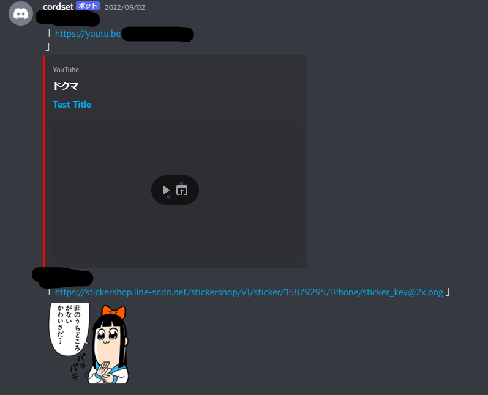
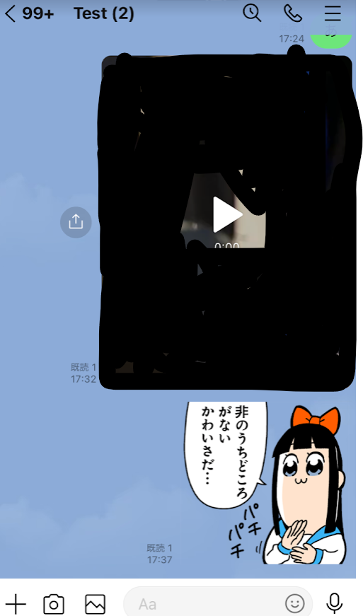
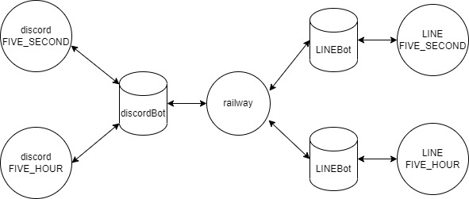

# Discordの多機能ボット
なんかいろいろ入ってます。

# 機能
・ボイスチャンネルの入退室通知  
・LINEとのメッセージ共有  
・カラオケ(テスト段階)  
・VOICEVOXによる読み上げ機能

# ボイスチャンネルの入退室通知

#### 画面共有  
  

# LINEとのメッセージ共有
     

LINE側でメンションも可能です。  


  

動画、スタンプも共有可能です。  



# カラオケ


# 使い方
本botはrailwayというサービスでのホストを想定しています。  
Dockerを使用しているので、簡単にホストできます。  
[](https://railway.app/new/template/NvsGee?referralCode=yFsnKR)  
line-bot-sdkを使用し、railway側でLINEとDiscordBotをホストできるようにしています。  

# LINE連携の仕様


## 時報と警告つき
無料フランの場合、LINE側には月1000件のメッセージ上限があります。  
それを回避するためのリミッターを設けてます。  
  

#### リミッターの計算式は以下のとおり。  
```bash
1日の上限=メッセージ上限/月末日
残りの上限=メッセージ送信数/本日の日付

1日の上限>残りの上限
この条件が成立している場合にDiscordからLINEへメッセージが送信されます。

=================================================================

メッセージ上限(無料プラン)=1000
例:6月の場合
6月の月末日=30

1000/30=33.333333

メッセージ送信数が1日の時点で10の場合
10/1=10

1日の上限>残りの上限
33.333..>10

条件が成立するので送信されます。

メッセージ送信数が4日の時点で140の場合
140/4=35

1日の上限>残りの上限
33.333..<35

条件が成立しないので送信されません。

```
また、条件が成立しなくなる場合(1日の上限を超える場合)、警告メッセージが送信されます。  
  

## 使用するサービス  
以下のAPI、サービスを使用します。  
|[](https://gyazo.com/api/docs)|[](https://developers.line.biz/console/?status=success)|[](https://discord.com/developers/docs/resources/webhook)|[](https://developers.google.com/youtube/v3/getting-started?hl=ja)|
|---|---|---|---|
|[Gyazoトークン](https://gyazo.com/api/docs)|[LINE Developers](https://developers.line.biz/console/?status=success)|[Discord Webhook](https://discord.com/developers/docs/resources/webhook)|[YouTube Date API](https://developers.google.com/youtube/v3/getting-started?hl=ja)|
|[参考(アーカイブ)](https://web.archive.org/web/20170724151212/http://yoshiyuki-hirano.hatenablog.jp/entry/2015/09/18/153155)|[参考](https://qiita.com/taka777n/items/c601421b871fd2b6a55f)|[参考](https://qiita.com/iroha71/items/b2a473898d6c9b4b4ae7)|[参考](https://qiita.com/koki_develop/items/4cd7de3898dae2c33f20)|  

LINEは画像や動画のファイルがバイナリデータとして渡され、一定時間で削除されてしまうのでGyazoとYouTubeにアップロードしてDiscordに送ります。  
YouTube APIは参考リンクをもとに、試しに動画をアップロードしておいてください。そうすると2つのjsonファイルが生成されると思うので控えておいてください。  
``` 控えておくjson
client_secret{ここに変な数字}.json
upload_video.py-oauth2.json
```

# 環境変数について

- SERVER_NAME <span style="color: red; ">**必須**</span>
```bash
・LINE連携を利用するDiscordサーバーの名前。カンマ区切りで複数のサーバーでも使用可能になる。
例：運用するサーバー名「FIVE_SECOND」「FIVE_HOUR」の2つの場合
SERVER_NAME=FIVE_SECOND,FIVE_HOUR

例のように設定すると以降の環境変数の名前は以下の通り宣言する。
FIVE_SECOND_WEBHOOK=
FIVE_SECOND_ACCESS_TOKEN=
FIVE_SECOND_CHANNEL_SECRET=
FIVE_SECOND_GROUP_ID=
FIVE_SECOND_GUILD_ID=
FIVE_SECOND_TEMPLE_ID=
FIVE_HOUR_WEBHOOK=
FIVE_HOUR_ACCESS_TOKEN=
FIVE_HOUR_CHANNEL_SECRET=
FIVE_HOUR_GUILD_ID=
FIVE_HOUR_TEMPLE_ID=

またLINE devloper側で設定するWebhookも
https://railwayで稼働させてるURL/FIVE_SECOND
https://railwayで稼働させてるURL/FIVE_HOUR
と設定する。
```

- _WEBHOOK
```bash
・時報や警告で使用するDiscordのWebhook。お知らせ的なチャンネルに設定するのがおすすめ。
```

- _ACCESS_TOKEN　<span style="color: red; ">**必須**</span>
```bash
・LINEBotのアクセストークン。
```

- _CHANNEL_SECRET <span style="color: red; ">**必須**</span>
```bash
・LINEBotのチャンネルシークレット。
```

- _GROUP_ID
```bach
・LINEのグループトークID。指定しない場合はDMにメッセージが送受信される。
```

- _GUILD_ID <span style="color: red; ">**必須**</span>
```bash
・DiscordのサーバーID。
```

- _TEMPLE_ID <span style="color: red; ">**必須**</span>
```bash
・Discordにメッセージを送信するテキストチャンネルのID。雑談とかにおすすめ。
```

- PORT=8080
```bash
・ポート番号。railwayでflaskを立ち上げるのに必須（と公式で推奨されている）。
デフォルトで8080
```

- GYAZO_TOKEN <span style="color: red; ">**必須**</span>
```bash
・画像保存サービス「GYAZO」のAPIトークン。
LINEからDiscordへ画像を送信する際に使用。
```

- TOKEN <span style="color: red; ">**必須**</span>
```bash
・DiscordBotのトークン。
```

- USER_LIMIT=100 <span style="color: red; ">**必須**</span>
```bash
・DiscordAPIを叩く際に取得するユーザーの上限。
値は何でもいいが大きいと処理が重くなる。
```

- CLIENT_SECRET_NAME <span style="color: red; ">**必須**</span>
```bash
・YouTube Data APIのPythonで発効された「client_secret.json」の名前。
```

- access_token <span style="color: red; ">**必須**</span>
```bash
・YouTube Data APIのPythonで発効された「client_secret.json」と「upload_video.py-oauth2.json」内でのトークン。
```

- client_id <span style="color: red; ">**必須**</span>
```bash
・YouTube Data APIのPythonで発効された「client_secret.json」と「upload_video.py-oauth2.json」内でのクライアントID。
```

- client_secret <span style="color: red; ">**必須**</span>
```bash
・YouTube Data APIのPythonで発効された「client_secret.json」と「upload_video.py-oauth2.json」内でのシークレットキー。
```

- refresh_token <span style="color: red; ">**必須**</span>
```bash
・YouTube Data APIのPythonで発効された「client_secret.json」と「upload_video.py-oauth2.json」内でのリフレッシュトークン。
```

- project_id <span style="color: red; ">**必須**</span>
```bash
・YouTube Data APIのPythonで発効された「client_secret.json」内でのプロジェクトID。
```

- token_expiry <span style="color: red; ">**必須**</span>
```bash
・YouTube Data APIのPythonで発効された「upload_video.py-oauth2.json」内でのトークン発行日時。
```

- VOICEVOX_KEY
```bash
・Web版VOICEVOXのAPIキー。
```

